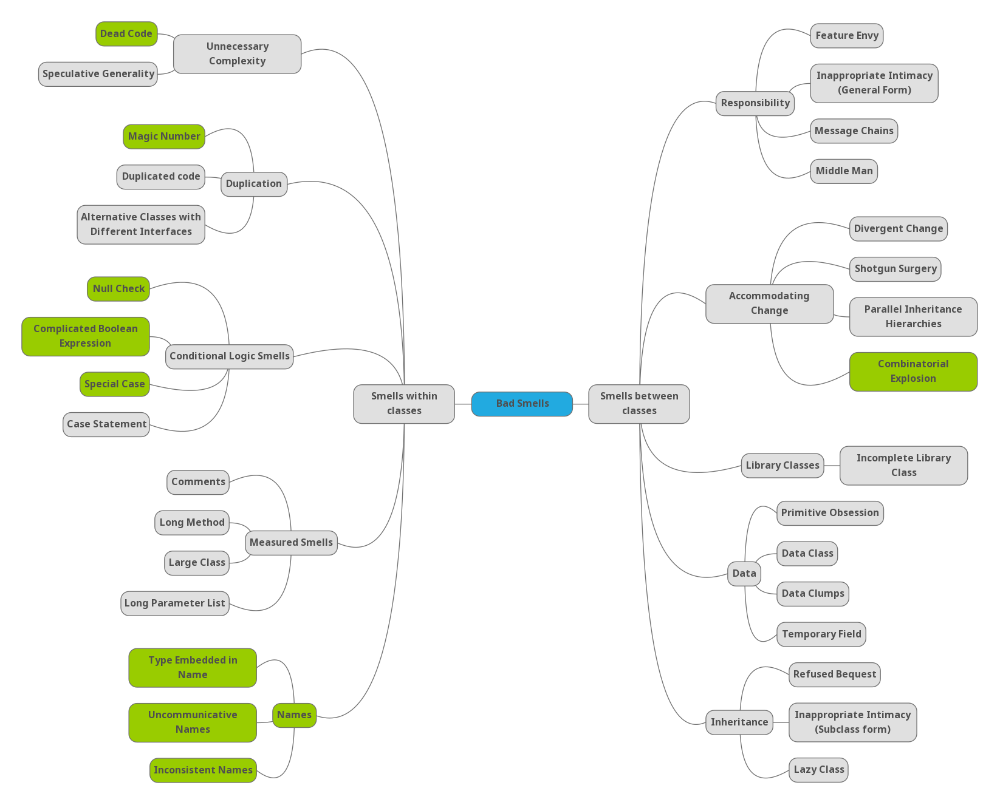
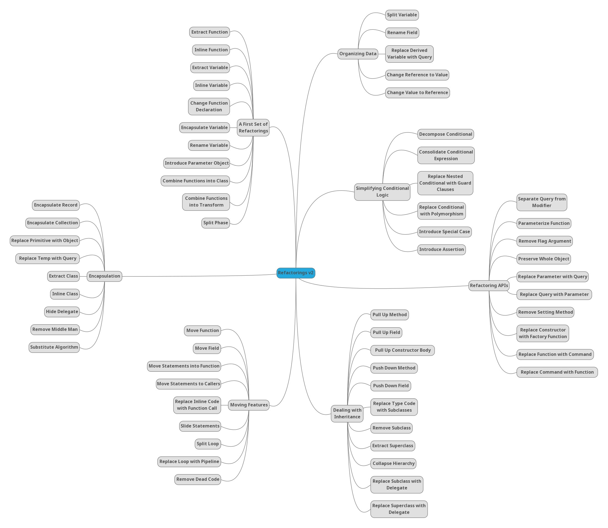

# Curso Codesai: code smells and refactoring

## Slides
1. [Introduction](./documentation/slides/1_Introduction.pdf)
2. [Code Smells within classes](documentation%2Fslides%2F2_Code_Smells_within_classes.pdf)
3. Code Smells between classes
   * [Code Smells between classes part 1](documentation/slides/3a_Code_Smells_between_classes.pdf)
   * [Code Smells between classes part 2](documentation/slides/3b_Code_Smells_between_classes.pdf)
4. Refactorings
   * [Patterns of Refactoring](documentation/slides/4a_Patterns_of_Refactoring.pdf)
   * [Core Refactorings](documentation/slides/4b_Core_Refactorings.pdf)
5. [Good Enough Design](documentation/slides/5_Good_Enough_Design.pdf)
6. [Hexagonal Architecture](documentation/slides/6_Hexagonal_Architecture.pdf)
7. [Workflows and Economics of Refactoring](documentation/slides/7_Workflows_and_Economics_of_Refactoring.pdf)

## Katas
* [Refactoring smelly mars rover](./katas/refactoring-smelly-mars-rover)

## Interesting links
* [Artículo: De taxonomías y catálogos de code smells](https://codesai.com/posts/2022/09/code-smells-taxonomies-and-catalogs)
* [Online Code Smells Catalog](https://luzkan.github.io/smells/)
* [Online catalog of refactorings](https://refactoring.com/catalog/)
* [PDF: A list of symptoms and the associated code smells](documentation/smells-and-their-solutions/wake_symptoms_and_smells.pdf)
* [PDF: A list of code smells and their associated refactorings](documentation/smells-and-their-solutions/wake_smells_to_refactorings.pdf)
* [PDF: Another list of code smells and their associated refactorings](documentation/smells-and-their-solutions/wake_smells_to_refactorings.pdf)
* [Refactoring.Guru: a list of code smells](https://refactoring.guru/refactoring/smells)
* [Refactoring.Guru: a list of refactorings](https://refactoring.guru/refactoring/techniques)

## More interesting links
* [Naming as a Process](https://www.digdeeproots.com/articles/on/naming-process/)
* [Code smells mindmap connected to Jerzyk's catalog](https://www.mindmeister.com/app/map/3025490820?t=nCw69SqYKL) (created by [Daniel Ramos](https://twitter.com/DanielRamosAcos))

## A modern classification of code smells

## A modern classification of refactorings

## Bibliografía
* Refactoring Workbook https://xp123.com/articles/refactoring-workbook/ <- en este libro se presenta la clasificación de Code Smells que vimos el primer día.
Tiene muchos ejercicios y relaciona muy bien los code smells con principios de diseño. Los ejemplos son en Java.
* Refactoring: Improving the Design of Existing Code 1st ed. https://www.goodreads.com/book/show/44936.Refactoring <- es la primera edición.
Todos los ejemplos vienen en Java. Incluye refactorings largos que ya no aparecen en la segunda edición.
Algunas mecánicas de refactoring han quedado obsoletas gracias a la potencia de los IDEs actuales (sobre todo en java), pero siguen siendo muy útiles
para otros lenguajes. El nombre de los refactorings se sigue usando en los IDEs.
La discusión de code smells es mejor en el Refactoring Workbook.
* Refactoring: Improving the Design of Existing Code 2nd ed. https://martinfowler.com/articles/refactoring-2nd-ed.html <- Todos los ejemplos son en JavaScript.
Los nombres de muchos refactorings han cambiado para ser más inclusivos con  otras formas de trabajar (lenguajes dinámicos y programación
funcional). El capítulo de smells ha variado un poco, creo que ha mejorado.
El capítulo en que se explica el concepto de refactoring, su implicación económica, las herramientas y los workflows de refactoring ha mejorado
muchísimo gracias a la experiencia acumulada durante un montón de años.
Creo que leería este libro primero, y luego dependiendo del lenguaje que te interese miraría el catálogo de refactorings de la primera edición
que sigue siendo más adecuado para lenguajes como Java o PHP.
* Refactoring to Patterns https://www.goodreads.com/book/show/85041.Refactoring_to_Patterns <- Este libro es muy interesante, pero es avanzado.
Exige conocimiento previo tanto de refactorings como de patrones de diseño.
Trata sobre refactorings de larga duración que te pueden llevar hacia o sacarte de ciertos patrones de diseño.
Estos refactorings largos se componen de sucesiones de mecánicas de refactoring descritas en el libro de Refactoring.
Más adelante recomiendo un libro de patrones de diseño. Los ejemplos están en Java.
* Implementation Patterns https://www.goodreads.com/book/show/781559.Implementation_Patterns <- este libro es como Clean Code pero creo que mejor razonado y con menos dogma. Es la versión Java de un libro que originalmente salió para Smalltalk, pero los principios y patrones que explican puede aportar muchísimo a cualquier programador.
* Agile Principles, Patterns, and Practices in C# https://www.goodreads.com/book/show/84983.Agile_Principles_Patterns_and_Practices_in_C_
<- la mejor explicación de SOLID y de los principios de gestión de dependencias entre paquetes que he visto. De cuando el autor no había caído aún en el dogmatismo. Los ejemplos están en C#, pero aporta mucho a cualquier lenguaje.
* Principles of Package Design https://matthiasnoback.nl/book/principles-of-package-design/
Complementa a Agile Principles, Patterns, and Practices in C# porque incluye un montón de ejemplos que ayudan a profundizar más en SOLID y en los principios de gestión de depedencias entre paquetes. Los ejemplos están en PHP.
* Practical Object-Oriented Design: An Agile Primer Using Ruby, 2nd Edition https://www.pearson.com/us/higher-education/program/Metz-Practical-Object-Oriented-Design-An-Agile-Primer-Using-Ruby-2nd-Edition/PGM334639.html <- una gran exposición de la OO desde la filosofía de modelar comportamientos y responsabilidades. Ojalá se usase en la enseñanza de OO. De hecho aún mejor como introducción, antes de leer este, sería:
* Java OOP Done Right https://www.goodreads.com/book/show/57982539-java-oop-done-right
* Head First Design Patterns https://www.oreilly.com/library/view/head-first-design/0596007124/ <- los patrones más usados explicados de una manera muy didáctica.
El libro es realmente bueno y trata las ideas con mucha profundidad. Al mismo tiempo consiguen hacerlo entretenido. ¡Toda una hazaña!
* Working Effectively with Legacy Code
https://www.oreilly.com/library/view/working-effectively-with/0131177052/
Este libro está muy bien para aprender técnicas que te permitan introducir tests en código legacy poco o no testable, y a partir de ahí poder empezar a refactorizarlo. También te ayuda a que te des cuenta de cómo hacer tu código más testable.
* Five Lines of Code
https://www.manning.com/books/five-lines-of-code
Es un libro reciente sobre refactoring. Su punto de vista es usar reglas en vez de code smells para detectar qué debes refactorizar. Todos los ejemplos están en TypeScript.
También es muy interesante que enseña mecánicas de refactoring basadas en aprovechar las utilidades del compilador (de TypeScript), no sólo en tener tests.
Contiene ideas muy buenas sobre refactorings grandes y economía del refactoring.
* Refactoring at Scale
https://www.oreilly.com/library/view/refactoring-at-scale/9781492075523/
Es un libro reciente sobre refactoring. Trata de refactorings largos que afectan a gran parte de la empresa. No se mete mucho en prácticas técnicas concretas a utilizar.
Lo que creo que está muy bien es lo que explican sobre detección, métricas, planificación, estimación, venta a producto, comunicación y seguimiento del refactoring.
* The Programmer's Brain
https://www.manning.com/books/the-programmers-brain
Muy interesante para entender cómo los code smells afectan a nuestra productividad a la hora de desarrollar. 