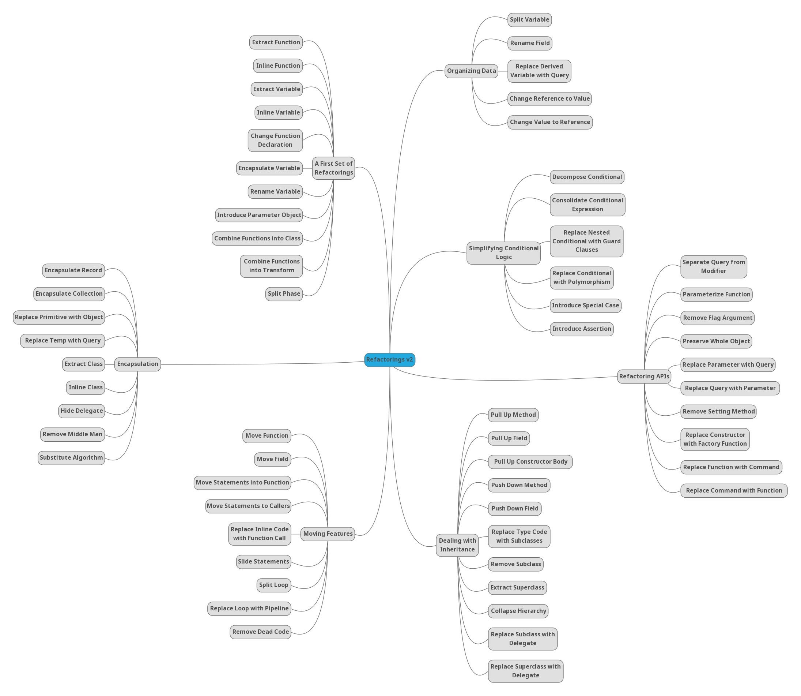

# Course documentation

## Slides
In the "slides" directory you can find the course slides.

## Interesting links
* [Artículo: De taxonomías y catálogos de code smells](https://codesai.com/posts/2022/09/code-smells-taxonomies-and-catalogs)
* [Online Code Smells Catalog](https://luzkan.github.io/smells/)
* [Online catalog of refactorings](https://refactoring.com/catalog/)
* [PDF: A list of symptoms and the associated code smells](./smells-and-their-solutions/wake_symptoms_and_smells.pdf)
* [PDF: A list of code smells and their associated refactorings](./smells-and-their-solutions/wake_smells_to_refactorings.pdf)
* [PDF: Another list of code smells and their associated refactorings](./smells-and-their-solutions/wake_smells_to_refactorings.pdf)

## More interesting links
* [Naming as a Process](https://www.digdeeproots.com/articles/on/naming-process/)

## A modern classification of code smells
* 

## A modern classification of refactorings
* 